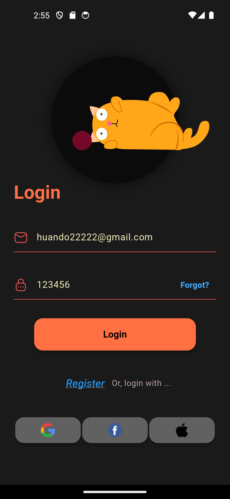
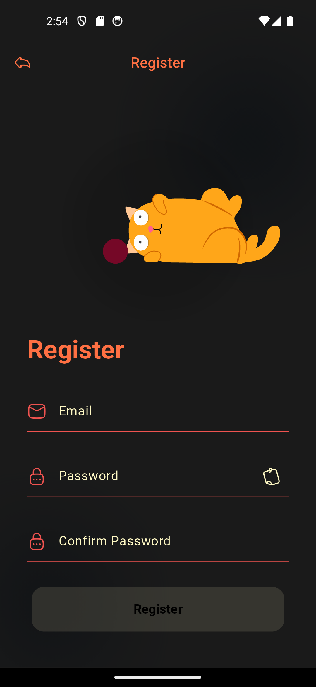
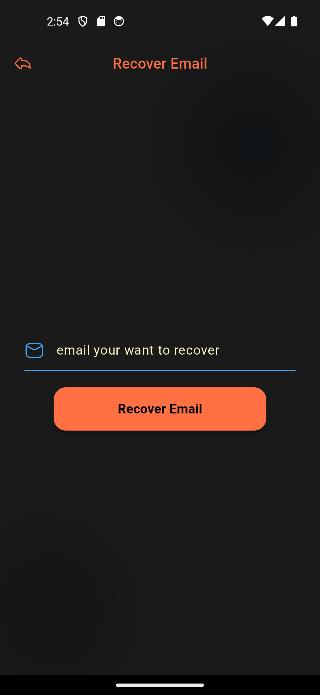
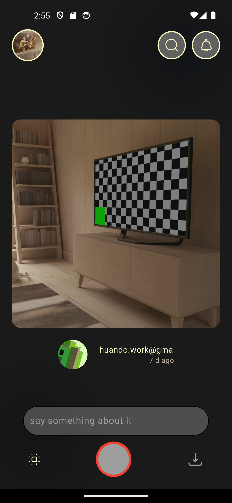
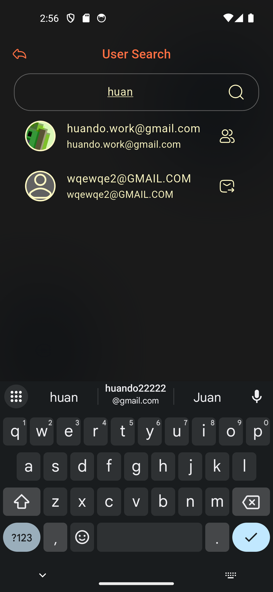
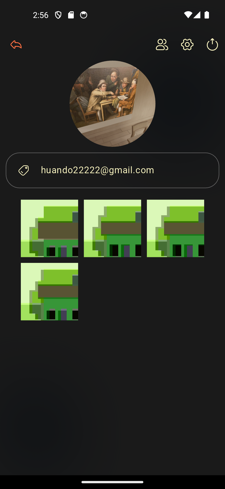
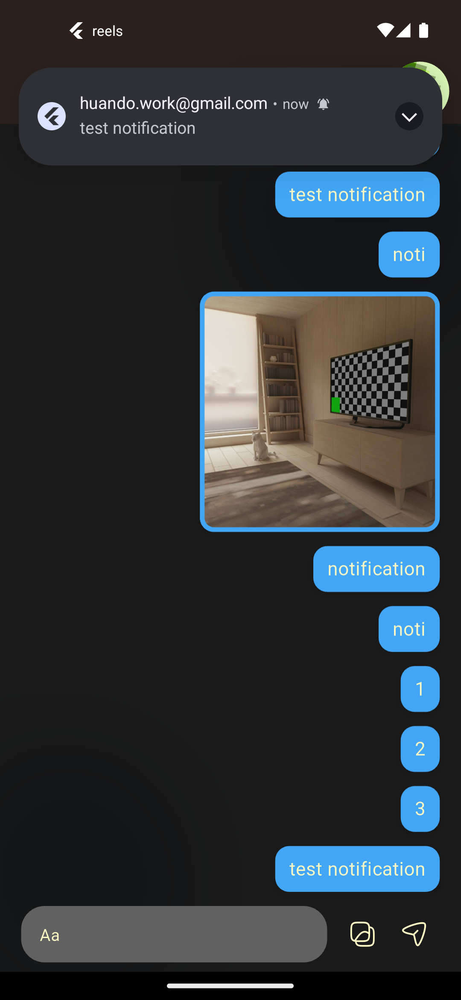

# reels

    
    
    

    
    
    

    

## Feature:

-   **Testing with account:**
    -   ✉️ Email: `huando22222@gmail.com`
    -   ✉️ Email: `huando.work@gmail.com`
    -   🔑 Password: `123456`
    -   or create a new account with your email
-   login with email and password (phone number , other social media will be added in future)
-   search/add friend user with email
-   chat/new post notifications
-   light/dark theme,
-   store file with supabase
